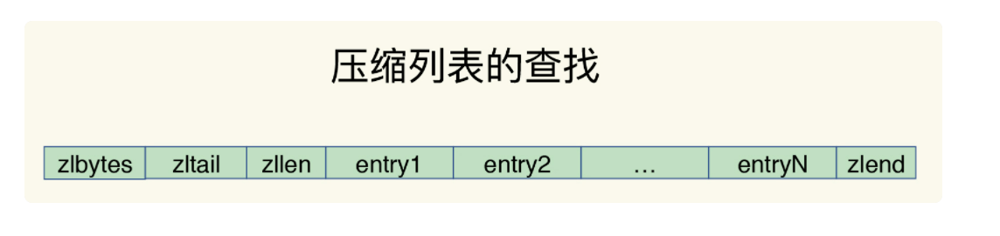
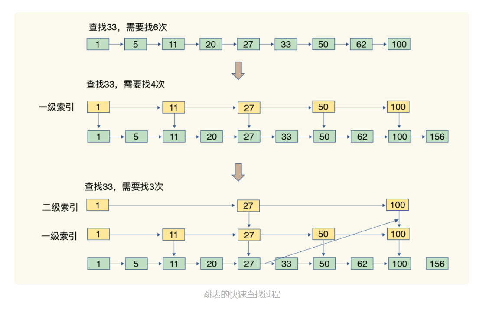
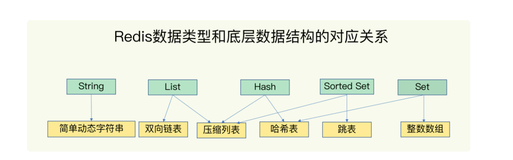

## Redis的数据结构

### 一、 键值对的关系的处理

1. `Redis`中使用哈希表对键值对key-value进行存储；实际使用`entry`元素结构存储哈希表中的某个桶信息；`entry`元素结构包含key和value的指针，分别指向具体的key和value；
2. Redis中的哈希表存储大致逻辑为：通过key计算出在内存哈希桶中桶的位置，然后使用`entry`结构保存key-value的指针（此时value指针指向其对应的数据结构）
3. 哈希冲突：当存储越来越多的数据时，同一个哈希桶下会使用链表结构（==哈希冲突链==）存储相同哈希值得数据；
4. 解决哈希冲突的方法：`rehash`
   * 由于哈希冲突导致链表越来越长会影响哈希表的遍历效率，所以需要对哈希表进行扩容；增加通的数量，从而让`entry`元素更分散的保存在不同的桶中；
   * Redis默认使用两张全局哈希表，表1和表2,；一开始插入数据时，默认使用表1，此时表2不分配空间
   * rehash分为三步：给表2分配空间（默认为表1的两倍）、将表1的数据复制到表2中、释放表1；
   * 如果只是单纯地执行上述操作，则有可能因为表1体积较大导致Redis线程阻塞；
   * 采用==渐进式rehash==：在第二步拷贝数据时，当处理一个请求时，将表1第一个索引位置数据拷贝到表2；处理下一个请求时再继续拷贝下一个位置的数据；

### 二、value的数据结构

1. value的数据类型有：String、List、Hash、Set、Sort Set五种；
2. 底层实现结构有：动态字符串、双向链表、压缩列表、哈希表、跳表、整数数组；
3. 整数数组和双向链表--优点是顺序读写，缺点是操作效率较低，时间复杂度为：O（N）
4. 压缩列表：
   * 本质是一个数组，但是表头有三个字段zlbytes、zltail、zllen，分别表示列表长度、列表尾的偏移量和列表中entry的个数；表尾还有一个zlend表示列表结束；
   
   * 当需要找表头和表尾元素、统计表长度时，操作可通过表头三个字段定位，所以时间复杂度为O(1)；但访问别的数据则同样为O（N）；
   
     
5. 跳表：
   * 在有序列表的基础上增加了==多级索引==，**该索引选取的方式为每M个元素选一个作为索引**，由于是有序列表，所以可以通过比较索引和查找值的大小，快速定位到数据；
   
   * 该数据结构的时间复杂度为：O(logN)；
   
   * 时间复杂度的计算：由于索引是每间隔M个元素选出来的，所以设总数组长度为N，索引长度为LogN,以M为底数，所以时间复杂度为O（logN）；
   
     

> 不同的时间复杂度：O(1)、O(N)、O(logN)等实际上表示的一个广义的阶段，其中O(logN)中底数可以为任意数字

6. 各数据类型对应的具体实现结构

   

> 集合类型都会有两种底层实现结构，（为什么？）
>
> Hash和Set类型，由于不记录数据插入的顺序，所以可以使用哈希表作为底层实现；
>
> Sort Set和List，由于需要记录数据插入顺序，所以使用压缩列表作为底层实现；
>
> Sort Set由于是有序列表的，所以使用跳表实现；

### 三、口诀

1. 单元素操作是基础（快）
   * 单元素操作是指==集合类型对单个元素进行增删改查操作==；
   * 时间复杂度由具体数据结构决定；如hash和list使用哈希表实现时，时间复杂度为O(N)；
   * 集合类型支持多个元素操作，这时复杂度由元素个数决定；
2. 范围操作非常耗时
   * 范围操作指对==集合类型的遍历操作==，返回集合中所有元素；
   * 时间复杂度一般为O(N)，所以尽量避免；
   * 2.8版本后提供SCAN操作，实现了==渐进式遍历==，每次返回有限个数，**避免了一次性遍历导致redis线程堵塞**；
3. 统计操作通常高效
   * 统计操作指==记录集合类型中的元素个数==；
   * 当采用压缩列表、双向链表、整数数组这些数据结构时，会记录元素的个数统计，时间复杂度为O(1)；
4. 例外情况只有几个
   * 指对某些特殊位置的元素的操作，如头元素、尾元素；
   * 在双向链表和压缩列表中，对表头表尾元素都有记录所以时间复杂度为O(1)；

