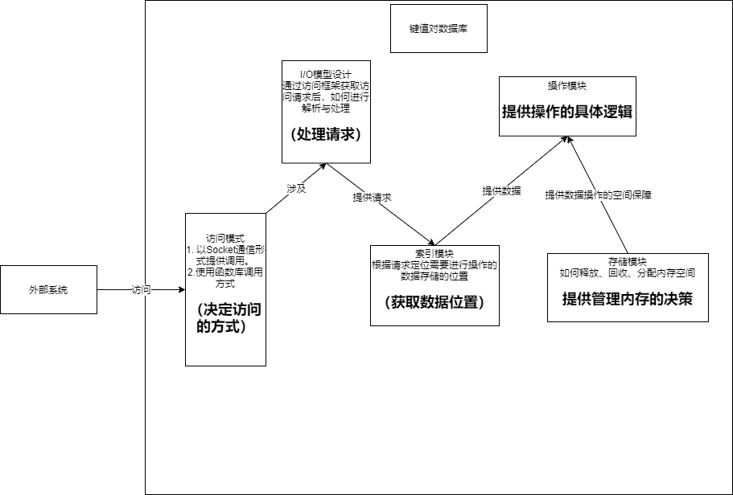
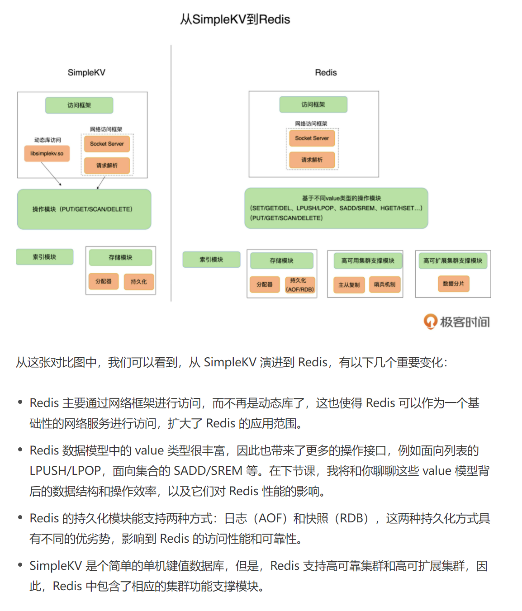

## redis系统基本构造

### 简易模拟redis框架的==键值数据库==--SimpleKV

### 一、数据模型--键值对结构

1. redis是一个键值数据库，基本的数据模型就是key-value；构造一个简单SimpleKV 模仿redis；
2. 不同的键值数据库支持的key类型差异不大，而value类型有较大差异；更多value类型的支持，可以支撑更多不同的业务的数据需求；**Redis在实际业务场景中的广泛应用，得益于其支持多样化的类型的value**；
3. 不同value类型，同样隐含不同的数据结构在性能、空间效率的差异；

###  二、接口操作--键值对操作

* PUT/SET：新写入或者更新一个key-value对；
* GET:根据一个key读取相应的value值；
* DELETE：根据key删除整个key-value对；
* SCAN：根据一个范围的key返回相应的value；（如查询某一时间段用户的访问记录）

### 三、存储设计--选择存储在内存或者外存

1. 内存键值数据库：将数据存放于内存中，优点-访问速度快；缺点-断电丢失数据；

### 四、四个部分

访问框架、索引模块、操作模块和存储模块；

### 访问框架

1. 访问模式通常有两种：
   * 通过函数库提供给外部应用使用，例如使用动态链接库连接；（RocksDb）
   * 通过网络框架以`Socket`通信的形式提供键值对操作；（Memcached和Redis）
2. I/O模型设计：对网络连接的处理、请求的解析以及数据存取的处理（即对一个调用请求所有的处理）应该使用一个线程还是多个线程进行设计；

### 索引模块

1. 索引的作用是让键值数据库根据key找到相应的value的存储位置；
2. 一般内存键值数据库使用哈希表作为索引，因为哈希表的O（1）高性能随机访问特性；

### 操作模块

1. 决定不同的操作指令的具体逻辑。
2. 提供键值对数据库给予不同数据类型的不同操作类型。

### 存储模块

1. 内存分配器：管理和处理内存分配以及回收；
2. 提供持久化的机制；

