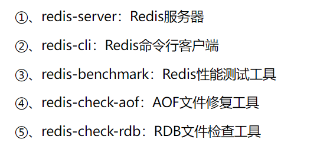

## linux下安装

1. 将redis安装包上传解压到linux服务器上；
2. 编译源码，需要gcc环境，所以先进行gcc安装：

```
yum install gcc-c++
```

3. 解压后进入redis目录，输入make命令进行编译

```
1 cd /opt/redis-4.0.9
2 make
# 建议使用一下指令执行编译转移二进制文件，方便启动
#make PREFIX=/usr/local/redis install 
```

4. 进入redis的bin目录（如果转移了则在转移的目录下的bin文件中）中能看到5个启动文件；

   

5. 启动指令：

```
redis-server redis.conf
```

6. 注意上述启动会一直打开交互窗口，如果想后台启动，则修改`redis.conf`文件下 `daemonize`配置为yes即可；
7. 可通过redis-cli访问redis

```
# -p参数是端口
redis-cli -p 6378
```

