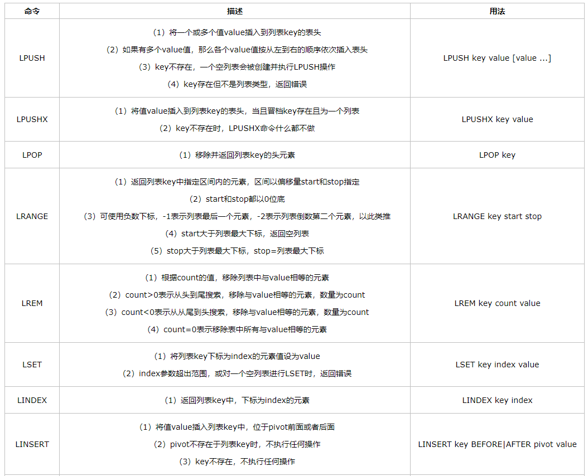
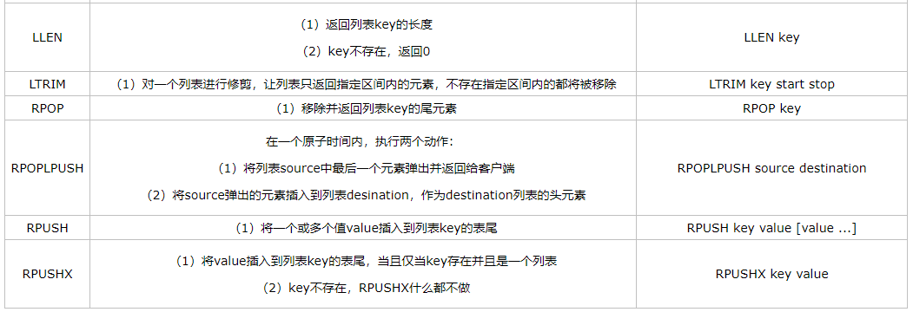
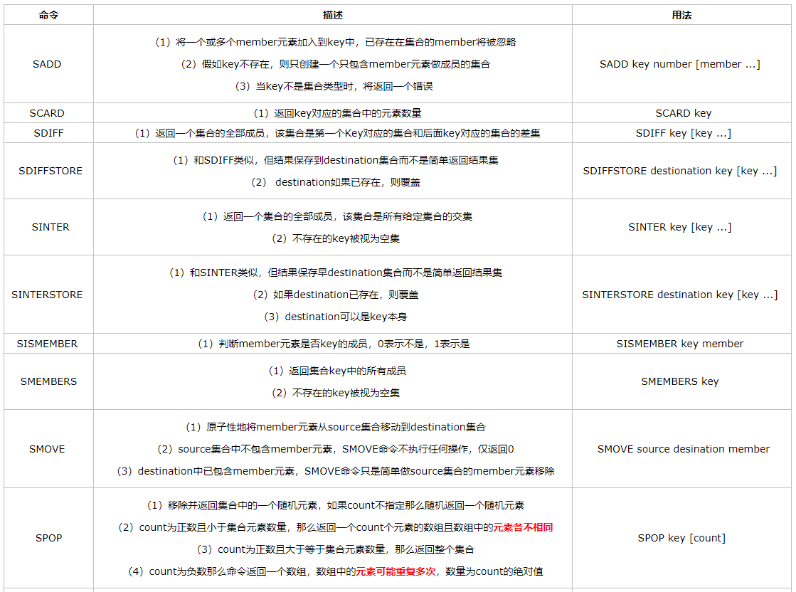
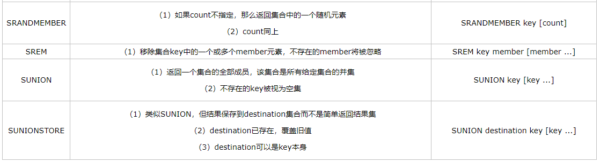
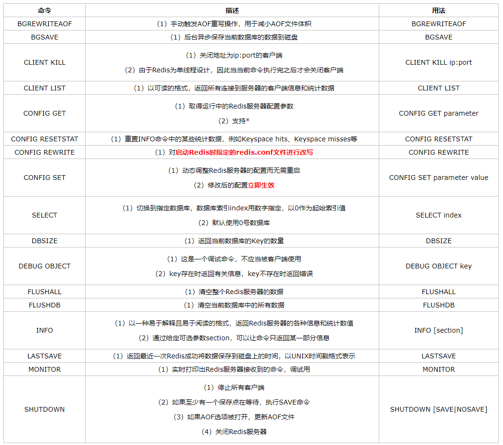
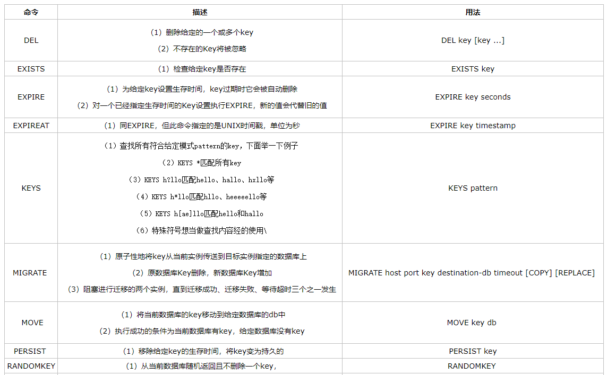
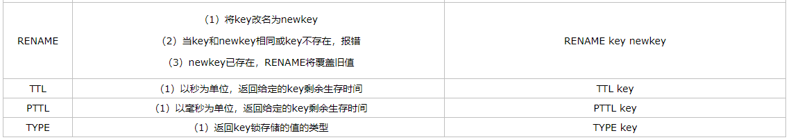

## 安装

https://www.cnblogs.com/ysocean/p/9074353.html

## 配置

https://www.cnblogs.com/ysocean/p/9074787.html

注意：配置中如果想远程连接，则需要将redis.conf配置文件中Bind参数注解掉。

## 通用指令

- **redis的指令大小写不区分，但是key值会区分**
- `ttl key`：查看某个key的存活时间


## 值类型

### 1. String类型

- 基本指令

| 操作命令 |                             描述                             |                         举例                          |
| :------: | :----------------------------------------------------------: | :---------------------------------------------------: |
|   SET    | （1）设置key-value；<br />（2）如果key值已存在，则覆盖其value；<br />（3）并且如果有过期时间则被清除，新的key不会有过期时间；<br />（4）后面可加参数：EX seconds（存活多少秒）或者PX milliseconds（存活多少毫秒）；<br />（5）NX（如已存在则不覆盖），XX（直接覆盖） | SET key value [EX seconds] [PX milliseconds] [NX\|XX] |
|   GET    | （1）获取对应value值，如果值类型不为String则报错；<br />（2）key不存在的时候返回Nil |                        GET key                        |
|   MSET   | （1）同时设置多个key-value；<br />（2）具有事务性即都更新或者都不更新；<br />（3）和SET一样会覆盖已有的 |          MSET key1 value1 [key2 value2....]           |
|   MGET   | （1）获取多个value；<br />（2）如果某个key的value不存在则返回nil |                 MGET key1 [key2....]                  |
|  SETEX   | （1）可设置存活时间；<br />（2）和SET后带参数不同在于：该操作设置存活时间是原子操作，即设置value和存活时间是一起的 |                 SET KEY seconds VALUE                 |
|  SETNX   |               当且仅当key不存在时设置其value值               |                    SETNX KEY VALUE                    |

- `setnx`可用于实现分布式锁。
- 自增自减操作指令：

|  指令  |                             描述                             |         举例         |
| :----: | :----------------------------------------------------------: | :------------------: |
|  INCR  | （1）key中的值自增1；<br />（2）key不存在时，先初始化0再执行INCR操作(所以结果为1);<br />（3）value不为数字时会报错 |       INCR key       |
|  DECR  |           （1）key中值自减1；<br />（2）其余同INCR           |       DECR key       |
| INCRBY |                 可设定增加的步长，其余同INCR                 | INCRBY key increment |
| DECRBY |                 可设定修改的步长，其余同DECR                 | DECRBY key increment |

- 自增自减指令使用场景：
  - 由于redis单线程，所以该操作线程安全；
  - 可用于限制某些业务操作的操作次数；


### hash数据类型

- 同样都是key-value键值对存储，只是value的数据类型转换成Map的形式；

- 将键值对中key看做是哈希表表名，field看做表列名，value则为对应表中的值；

- 指令，下面例子中所有key均看做table：

  |  指令   |                             描述                             |                     举例                      |
  | :-----: | :----------------------------------------------------------: | :-------------------------------------------: |
  |  HSET   | （1）和get一样设置对应value值，会覆盖已存在的field;<br />（2）不带参数，不能设置存活时间 |            HSET table field value             |
  |  HGET   |         获取某一个table中field的值，不存在则返回nil          |            HGET table field value             |
  |  HDEL   | （1）删除一个或多个table中的field;<br />（2）不存在的field会被忽略；<br />（3）没法把整个table直接删掉，即field必填 |        HDEL table field1 [field2....]         |
  | HEXISTS |        查看表中某个field是否存在，存在返回1，否则为0         |              HEXISTS table field              |
  | HGETALL |                   返回表中所有field和value                   |                 HGETALL table                 |
  |  HKEYS  |                      返回表中所有field                       |                  HKEYS table                  |
  |  HVALS  |                      返回表中所有value                       |                  HVALS table                  |
  | HINCRBY | （1）为表中某个field增加一定步长，与INCRBY一致；<br />（2）只有这个自增，无法类比使用其他自增自减指令 |         HINCRBY table field increment         |
  |  HLEN   |                  返回table中field-value数量                  |                  HLEN table                   |
  |  HMSET  |                            同mset                            | HMSET table field1 value1 [field2 value2....] |
  |  HMGET  |                            同mget                            |        HMSET table field1 [field2....]        |


### list数据类型

- value是一个简单的**字符串列表**，按插入顺序排序；

- 可添加到尾部或者头部；

- 特定：有序，可重复；

- 理解：能当做一个数组，能对list中每一个元素进行指定的单独操作；

- 基本指令





- 使用场景：
  - 实现栈功能：使用`lpop`和`lpush`；
  - 实现队列功能：使用`lpush`和`rpop`；
  - 实现有限集合：`lpush+ltrim`；
  - 实现消息队列：`lpush+brpop`；

### set数据类型

- 是String的无序集合
- 特点：无序，不可重复
- 常用于进行集合的交、并、合、差集运算；
- 常见命令：





### zset数据类型

- String集合、有序、不可重复；

- 常见指令：

  

- 常见用法：既有set的特性，所以可以用作进行集合的计算工作，又是有序的，所以可以做排行等操作。

### redis5.0新数据结构-stream


用于显示数据结构的底层数据实现指令：

```
OBJECT ENCODING    key  
```


## 系统相关指令：



## key相关操作指令





## 参考

https://www.cnblogs.com/ysocean/tag/Redis%E8%AF%A6%E8%A7%A3/


## 学习链路

redis自身特性-->jedisAPI接口-->lettuceAPI接口（spring2.xx后使用，这个又涉及到netty）-->spring-boot-redis-->cache