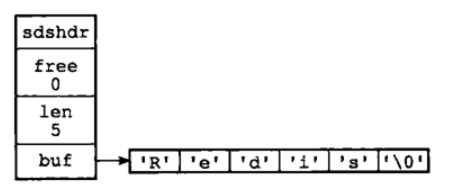
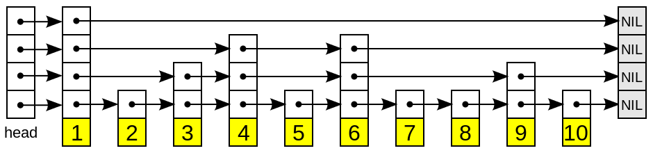
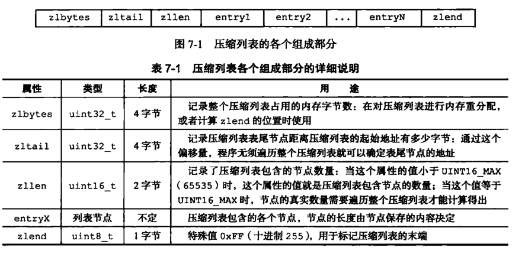

## 1. 动态字符串

1. `redis`使用C语言进行实现，其字符串存储是仿照C语言字符串的实现进行实现的，构建了一种称为`SDS`的抽象类型（简单动态字符串）；

2. 简单理解中可将`SDS`看做如下定义：（实际可看另一篇）

```
struct sdshdr{
     //记录buf数组中已使用字节的数量
     //等于 SDS 保存字符串的长度
     int len;
     //记录 buf 数组中未使用字节的数量
     int free;
     //字节数组，用于保存字符串
     char buf[];
}
```



3. 使用该结构相比对C语言字符串结构的优点：

- 一是：**获取字符串长度快**，由于`len`属性存在，对于计算字符串长度的请求可直接返回，时间复杂度为O(1)；而C语言需要遍历进行计算，时间复杂度为O(N)；
- 二是：**杜绝缓冲区溢出**，C语言在进行字符串操作的时候，如果没有分配好足够长度的内存空间，容易出现缓冲区溢出；而对于`SDS`数据类型，会根据`len`属性检查内存空间是否满足需求，不满足时会进行空间扩展，所以不会出现缓冲区溢出；
- 三是：减少**字符串空间的重新分配次数**，C语言修改字符串需要重新分配内存，不然容易导致内存问题；而对于SDS，由于len和free属性，可以实现空间预分配和惰性空间释放两种策略
  - 空间预分配：对字符串进行空间扩展的时候，扩展的内存比实际需要的多，这样可以减少连续执行字符串增长操作所需的内存重分配次数。
  - 惰性空间释放：对字符串进行缩短操作时，程序不立即使用内存重新分配来回收缩短后多余的字节，而是使用 free 属性将这些字节的数量记录下来，等待后续使用。（当然SDS也提供了相应的API，当我们有需要时，也可以手动释放这些未使用的空间。）
- 四是：**二进制安全**，由于C语言字符串以`/0`（空字符）结尾，所以无法正确存储二进制数据；而SDS不根据空字符判断字符串是否结束，所以可以放心存储二进制数据（**但SDS也是在字符串结尾使用空字符的**）
- 五是：**兼容C语言字符串操作**；

## 2. 链表

1. 结构：

```
typedef  struct listNode{
       //前置节点
       struct listNode *prev;
       //后置节点
       struct listNode *next;
       //节点的值
       void *value;  
}listNode
```

2. 操作链表结构：

```
typedef struct list{
     //表头节点
     listNode *head;
     //表尾节点
     listNode *tail;
     //链表所包含的节点数量
     unsigned long len;
     //节点值复制函数
     void (*free) (void *ptr);
     //节点值释放函数
     void (*free) (void *ptr);
     //节点值对比函数
     int (*match) (void *ptr,void *key);
}list;
```

3. 特点：

- 双端：头尾节点有直接引用，获取这两个节点的复杂度为O(1)；
- 无环：头节点和尾节点的前指针和后指针均指向NULL；
- 长度直接存储于一个常量之中；
- 多态：多链表使用`void*`指针保存节点值，代表可以保存任意类型的数据；

## 3. 哈希

1. 解决哈希冲突的方法：链地址法，即对相同key的value通过链表连起来；

2. 扩容和收缩：会有两张表，扩容时是原表两倍大，收缩时是缩小一倍；重新计算对应的哈希值并迁移所有键值对；

3. 触发扩容条件：

- 负载因子 = 哈希表已保存节点数量 / 哈希表大小。
- 服务器目前没有执行 BGSAVE 命令或者 BGREWRITEAOF 命令，并且负载因子大于等于1。
- 服务器目前正在执行 BGSAVE 命令或者 BGREWRITEAOF 命令，并且负载因子大于等于5。

- 渐进式rehash

## 4. 跳表

1. 跳表是一种有序的数据结构，本质是由多层的链表组成；
2. 每一层都是有序的链表，至少包含两个节点，头尾节点；最底层包含所有节点；
3. 一个节点出现在某一层，则在下层必定会出现；每个节点都有两个指针，一是**指向同一层下一个节点**的指针，二是**指向下一层同一个数据节点**的指针；



4. 实际跳表存储的时候，层级结构并不是很规范，因为每一个节点的层数是随机的；即谁在第几层是没有具体标准。即每一层之间元素的步长没有明确的规定与关系，可能隔4个，也可能只隔2个；
5. 搜索：从最高层的链表节点开始，如果比当前节点要大和比当前层的下一个节点要小，那么则往下找，也就是和当前层的下一层的节点的下一个节点进行比较，以此类推，一直找到最底层的最后一个节点，如果找到则返回，反之则返回空。
6. 插入：首先确定插入的层数，有一种方法是假设抛一枚硬币，如果是正面就累加，直到遇见反面为止，最后记录正面的次数作为插入的层数。当确定插入的层数k后，则需要将新元素插入到从底层到k层。（**对应第4点**）
7. 删除：在各个层中找到包含指定值的节点，然后将节点从链表中删除即可，如果删除以后只剩下头尾两个节点，则删除这一层。


## 5.整数集合

1. 可以保存类型为int16_t、int32_t 或者int64_t 的整数值，并且是有序、不重复的；
2. 定义如下：

```
typedef struct intset{
     //编码方式
     uint32_t encoding;
     //集合包含的元素数量
     uint32_t length;
     //保存元素的数组
     int8_t contents[];
 
}intset;
```

3. 具体存储的数据类型（int16_t、int32_t 或者int64_t）由`encoding`属性决定；

4. 升级：当新增数据类型大于原有集合类型时，需要先对整个集合进行升级才能放入（如一个int16_t的集合，要放入int32_t的数据）；

   > 方法：先重新分配空间，然后将原集合数据转变类型再放入新空间并保证有序，最后放入新元素；

5. 降级：不支持降级操作；

## 6. 压缩列表

1. 是Redis为了**节省内存**而开发的，是由一系列特殊编码的连续内存块组成的顺序型数据结构，一个压缩列表可以包含任意多个节点（entry），每个节点可以保存一个字节数组或者一个整数值。

2. **压缩列表的原理：压缩列表并不是对数据利用某种算法进行压缩，而是将数据按照一定规则编码在一块连续的内存区域，目的是节省内存。**



