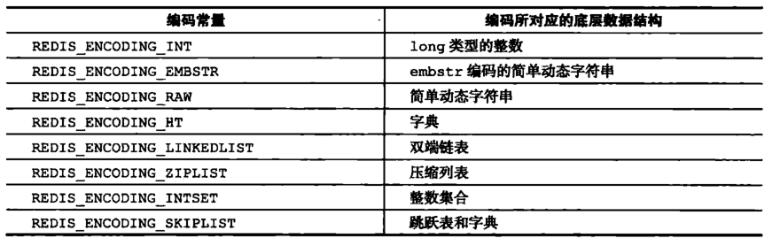
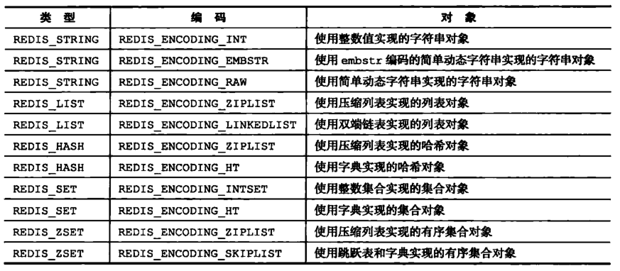

## 关系

1. 每种数据类型（字符、set、list、哈希、zset）都至少使用了一种数据结构去实现；
2. 针对不同的场景，可以为数据对象设置多种不同的数据结构，从而优化数据对象在不同场景下的使用效率；

## 对象储存结构

1. `Redis`中每一个对象都是由`type`、`encoding`、`prt指针`三个比较重要的属性组成；

2. `type`表示数据对象的数据类型；
3. `endcoding`表示对象底层的数据结构编码；
4. `prt指针`指向对象实际储存的数据结构；

- 可以使用`type key`指令查看储存的数据对象的数据类型（字符、set、list、哈希、zset）；
- `Redis`的键是一个字符串对象，其值可以为字符、set、list、哈希、zset对象；

- 编码与数据结构对应关系：

- 数据类型对应会使用的数据结构编码：

- 可以使用`OBJECT ENCODING  key`指令查看值对象的结构编码。