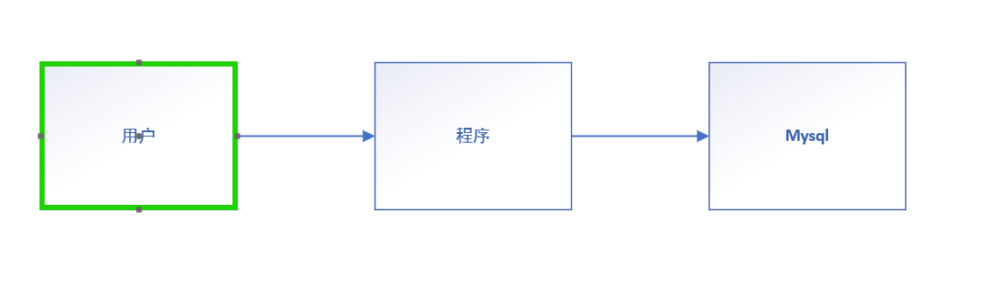
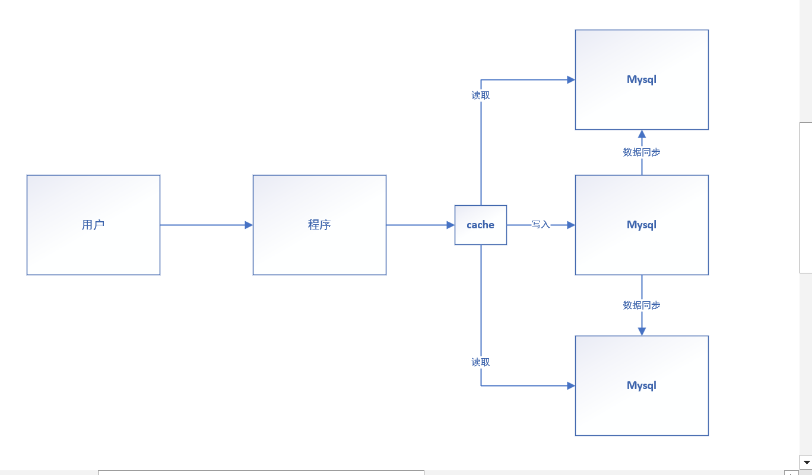
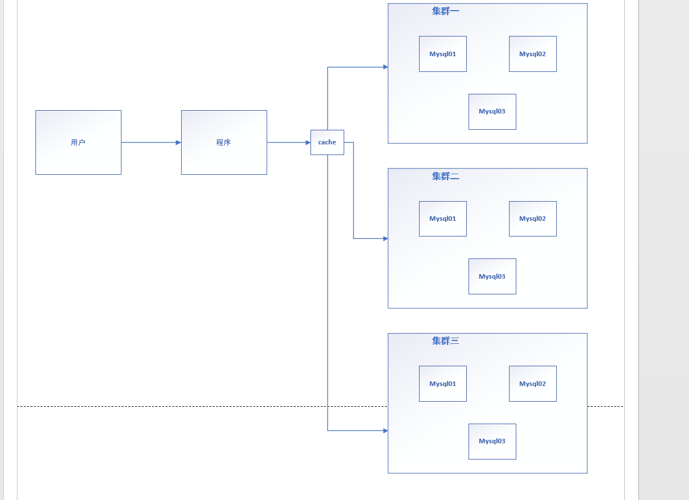

## `mysql`应用发展

## 单机时代

1. 应用和`mysql`都使用单机部署，应用直连`mysql`查询获取数据；
2. 缺点：可接纳访问量小（读写能力差）；可存储数据量少；

## 缓存+ 读写分离

1. 为了扩展应用读写能力，加入缓存和读写分离等概念进行扩展；

2. 缓存：采用`memcached`，对数据库常被访问数据进行缓存，加快用户读取速度；

3. 读写分离：一台服务器负责写入，另外的数据库服务器负责处理读操作以及同步写入操作的服务器数据。

4. 该阶段可放入多个`mysql`服务器，形成单一读写集群；

   

## 分库分表 + 多`mysql`集群

1. 进一步扩展针对访问能力进行提升，本质上就是提升数据的读和写；
2. 分库分表解决**写**的压力；
   - 通过业务，将一张大表的字段进行拆分，拆分成独立的多张表（**分表**）；
   - 通过业务功能的区分，将同一个库中的多张表，拆分到多个库中，每个程序再对应不同数据库进行读写（**分库**）；例如支付功能的表在p库，下单功能的表在n库；
3. 多集群解决**读**的压力；

## NoSQL的四大分类

#### KV键值对：

- 新浪：redis
- 美团：redis + Tair
- 阿里、百度：redis + memecache

#### 文档型数据库（bson格式和json一样）：

- MongoDB
  - 基于分布式文件存储数据库，C++编写，主要处理大量文档；
  - 介于非关系型数据库和关系型数据库之间；
- ConthDB

#### 列存储数据库

- HBase
- 分布式文件系统

#### 图关系数据库

- 用于存储**关系**的数据；
