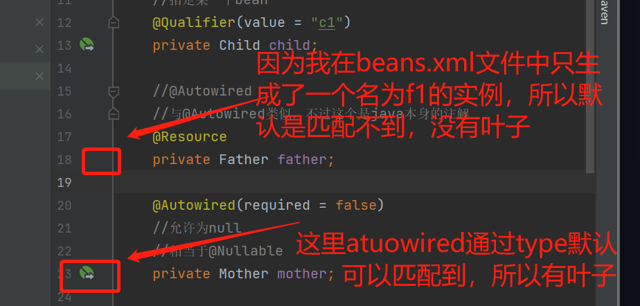

byname：

bytype：需要全局唯一。


## 使用注解实现

#### bean.xml文件修改

​	需要修改其头部，添加namespace说明

```xml
<beans xmlns="http://www.springframework.org/schema/beans"
       xmlns:xsi="http://www.w3.org/2001/XMLSchema-instance"
       //对应上面xmlns行，只是头部和最后修改成context
       xmlns:context="http://www.springframework.org/schema/context"
       xsi:schemaLocation="http://www.springframework.org/schema/beans
        http://www.springframework.org/schema/beans/spring-beans.xsd
        //按上面两行修改，将beans替换成context
        http://www.springframework.org/schema/context
        http://www.springframework.org/schema/context/spring-context.xsd">
    <!--使用注解自动装配-->
    <context:annotation-config/>
```

### spring标签--@Autowired

1. 使用在成员变量上，优先按type进行匹配对应bean，其次再按name；

2. 注解是直接通过反射类对象获取类所有信息，可以直接对私有属性进行赋值，==所以使用注解的时候不需要使用set()方法==；（还需要成员变量符合第一点的说明，才能让IOC容器匹配上）。

   类：

   ```java
   public class Home {
       @Autowired
       private Child child;
   
       @Autowired
       private Father father;
   
       @Autowired
       private Mother mother;
   }
   ```

   beans.xml文件：

   ```xml
   	<!--由于优先通过type匹配，所以id与成员变量名不一致也没关系（只有一个同类型的bean的时候）-->
   	<bean id="f1" class="com.dwh.annotation.Father"/>
       <bean id="m1" class="com.dwh.annotation.Mother"/>
       <bean id="c1" class="com.dwh.annotation.Child"/>
       <bean id="h1" class="com.dwh.annotation.Home"/>
   ```

   

3. `@Autowired(required = false)`标记允许注入对应bean为null。默认该属性为true不为空

### spring标签--@Nullable

​	作用：标记允许成员变量为空；

### spring标签--@Qualifier(value="...")

​	作用：当有多个bean实例在IOC容器中时，可以通过该标签指定某一个bean注入；

### java标签--@Resource

1. 与@Autowired作用一致；

2. 与@Autowired区别：默认先通过byName进行匹配，后通过byType匹配。（在IDea中如果可以直接默认匹配上，会有一个小叶子）

   

3. `@Resource(name = "f1")`可以指定某个bean。