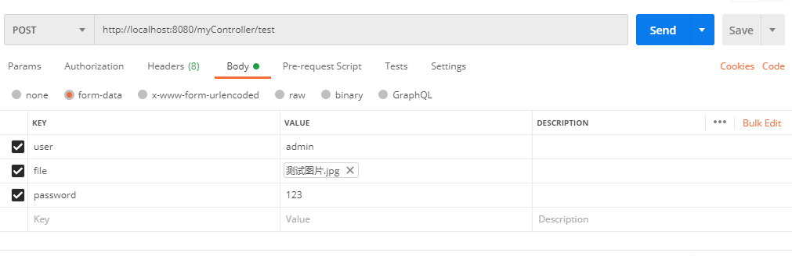

### Get请求
由于是get请求，所以参数都在url上；**不需要Content-Type标注参数类型，使用SpringMVC可以进行直接映射**；

#### 使用@RequestParam标签获取参数
    ```
        public String testGetToken(String password, @RequestParam(value = "remoteUser") String user){
            ...
        }
    ```
1. 注解使用在方法对应参数之前，标注该参数获取；
2. 该标签属性：
    * vaule/name:这两个属性都是一样的，用来**给参数取别名**，如上例子中:value=remoteUser，则前端传入参数时参数名为remoteUser，但方法声明中可声明参数为user，即**为user这个参数取了一个别名remoteUser**；如果不取别名，则前端传入参数时参数名则为user；但**不能同时出现，否则请求时会报错！一般看习惯选择其中一个即可**
    * required:该参数是否必填，默认为true（必填）；如果为**false,则当前端不传该参数时，该参数值为null(没有声明defaultValue属性时)**;
    * defaultValue:给参数在没传时，设默认值；
3. 如果不加该注解，如例子中的password，spring同样会找url中password属性，如果有则赋值，如果没有就为Null；等价于@RequestParam(value = "password", required = false)

#### 使用@PathVariable获取参数
    ```
        @GetMapping("/demo/{id}")
        public void demo(@PathVariable(name = "id") String id, @RequestParam(name = "name") String name) {
            System.out.println("id="+id);
            System.out.println("name="+name);
        }

        访问url为：http://localhost:8080/demo/123?name=admin
    ```
1. 该标签获取的是路径参数，**url中使用{xxx}占位符使url中的参数可以绑定到操作方法的入参中**；上面例子中，id获取的是url中'demo/123'这段中123这个值；
2. @PathVariable也有一个required属性，默认为true；但是测试中设置成false后，无法正常访问，原因应该是设置成false之后url识别不出来了，所以不用管这个属性。


### POST请求
1. 首先需要了解一下multipart/form-data、x-www-form-urlencoded等MIME类型的区别和对请求报文体中参数传递的机制；

#### multipart/form-data 就是postman中的form-data

1. 报文体：上传了两个键值对(user=admin和password=123)和一个文件（file=测试图片.jpg）
    ```
        POST /myController/test HTTP/1.1
        Host: localhost:8080
        Content-Type: multipart/form-data; boundary=----WebKitFormBoundary7MA4YWxkTrZu0gW  (此处为分析说明：boundary说明这段消息的分隔符为：----WebKitFormBoundary7MA4YWxkTrZu0gW)

        ----WebKitFormBoundary7MA4YWxkTrZu0gW
        Content-Disposition: form-data; name="user"        (此处为分析说明：name为键值对中key值)

        admin                                               (此处为分析说明：这里为value值)
        ----WebKitFormBoundary7MA4YWxkTrZu0gW
        Content-Disposition: form-data; name="file"; filename="/C:/Users/4/Desktop/测试图片.jpg"
        Content-Type: image/jpeg                        （此处为分析说明：上传文件时会加上Content-Type进行说明）

        (data)                                         （此处为分析说明：这里data应该是文件的字节数组，用于传输）
        ----WebKitFormBoundary7MA4YWxkTrZu0gW
        Content-Disposition: form-data; name="password"

        123
        ----WebKitFormBoundary7MA4YWxkTrZu0gW
    ```
2. 该类型传输数据会将**表单数据**处理为一条消息（约定格式的字符串）存放在消息体body中。以标签为单元，用分隔符分开，**使用Content-Disposition说明字段信息,boundary说明分隔符是什么**；既可以上传键值对，也可以上传文件，上传文件时，会加上Content-Type来说明文件类型。
3. 由于数据之间是分隔开来的，所以可以使用该方式推送多个文件；

#### application/x-www-from-urlencoded 就是postman中的x-www-from-urlencoded
1. 将**表单数据**转化为键值对，存放在消息体中Body；
2. 消息报文：
    ```
        POST /myController/test HTTP/1.1
        Host: localhost:8080
        Content-Type: application/x-www-form-urlencoded

        user=admin&password=123
    ```
3. **键值对之间使用&分隔开来**；
4. SpringMVC默认的数据传输类型是application/x-www-from-urlencoded；
5. SpringMVC接收:
    * 直接使用实体类对象接收：
        ```
        @RequestMapping(value = "Post", method = RequestMethod.POST)
        public String test(TesInfo map){
            //TesInfo类为自定义的实体类，有成员变量name和password
            ....
        }
        ```
        **不需要添加标签!**,spring会自动对键值对进行匹配；特殊情况：如果url上也有同名的参数，如请求url为ip:port/Post?name=admin,请求体中也有name=admin2,则用实体类对象接收时（如TesInfo类），其成员变量会自动变成以逗号','分隔的字符串（如TesInfo.name="admin,admin2"）;
    * 使用参数（String类型,Integer等基本数据类型和对应数组），**暂时实验结果：**会将传入的参数先当做String类型，然后转成别的基本数据类型；如果url上有同名属性，其值也会被组装成以逗号','分隔的字符串或者数组（**但是输入password=[123,456]如果用String数组接收的话，会以逗号做为分隔符，自动切分成数组元素**）；加入@RequestBody标签会将整个请求体的json串赋值给对应的变量上；加入@RequestParam标签不行，获取不了；


#### raw
1. 可以上传任意格式的文本，可以上传text、json、xml、html等,并在报文头部header中标注对应的Content-Type属性值；
2. 选择上传json格式时：Content-Type: application/json；
3. 选择上传text格式时：Content-Type: text/plain；
4. 选择上传javaScript格式时：Content-Type: application/javascript；
5. 选择上传html格式时：Content-Type: text/html；
6. 选择上传xml格式时：Content-Type: text/xml;

#### binary
1. 用来上传文件，一次只能上传一个**二进制文件**，报文头部header中Content-Type的值根据具体文件类型进行变化；类似于Content-Type:application/octet-stream的上传方式；


#### application/json
1. 声明传输的请求报文中Body报文体中是一个json格式的数据，具体报文样式：
    ```
        POST /myController/TestPost?password=123&user=admin HTTP/1.1
        Host: localhost:8080
        Content-Type: application/json

        {"user":"admin","password":"123"}
    ```
2. SpringMVC接收该类型参数的方式：
    * 直接在操作方法上添加参数是不行的，spring框架不会自动**对报文的Body中的json串进行解析并做映射**；但直接加参数可以映射到添加在url后面的参数（即拼接在url后的参数键值对，demo/123?name=admin这种）；
    * 只能使用@RequestBody标签，搭配上Map<String, object>或者自定义实体类的参数，注意如果是实体类，则类中成员变量的命名要与请求参数相一致；
    * **上面两个可以同时使用，不过获取的参数位置不一样**；


### 参考
1. https://blog.csdn.net/suki_rong/article/details/80445880 接收参数的方式
2. https://blog.csdn.net/wangjun5159/article/details/47781443 各种post传参方式的区别
3. https://pig66.blog.csdn.net/article/details/78455053?utm_medium=distribute.pc_relevant.none-task-blog-BlogCommendFromMachineLearnPai2-2.channel_param&depth_1-utm_source=distribute.pc_relevant.none-task-blog-BlogCommendFromMachineLearnPai2-2.channel_param 详解springmvc接收参数
4. https://blog.csdn.net/justry_deng/article/details/80972817/?biz_id=102&utm_term=requestbody&utm_medium=distribute.pc_search_result.none-task-blog-2~all~sobaiduweb~default-0-80972817&spm=1018.2118.3001.4187
5. https://blog.csdn.net/walkerJong/article/details/7520896