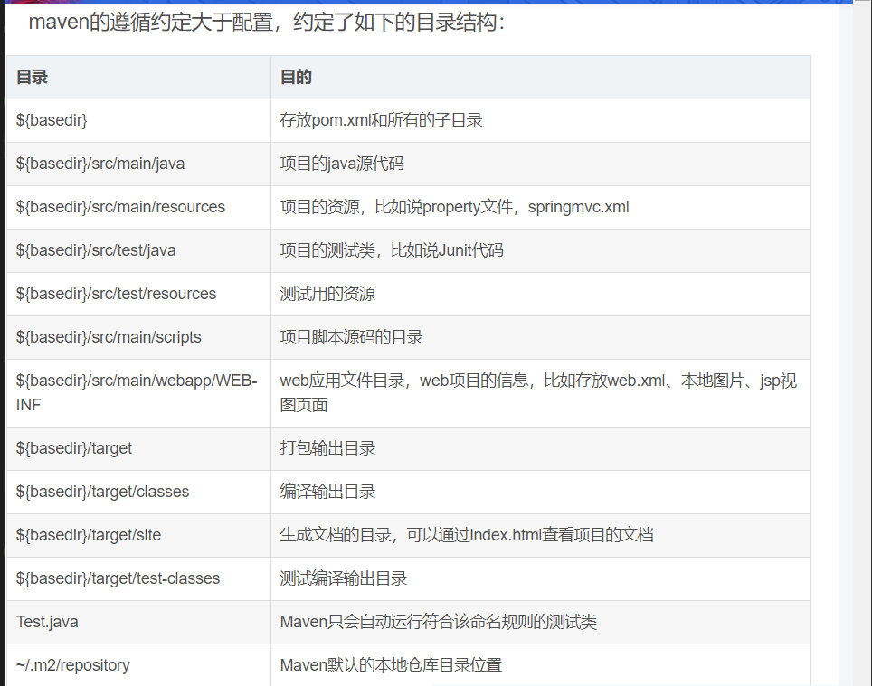

### maven项目-POM文件
1. ${basedir}:表示是存放pom.xml文件的根目录位置；其他约定的maven项目目录如图：
 
2. project是Pom文件的根元素；其中groupId、artifactId、version三个元素用来定义一个项目的坐标确定为唯一的一个maven项目；
3. 特殊注意的元素标签：
    * modelVersion：指定了当前POM模型的版本，对于Maven2及Maven 3来说，它只能是4.0.0；
    * packaging：这是项目产生的构件类型，即项目通过maven打包的输出文件的后缀名，包括jar、war、ear、pom等。

#### build标签
1. 用来定义构建项目需要的信息
2. 拥有的主要标签有：

##### 一、路径管理
一般不需要修改都是使用默认；用来声明对应项目源代码、测试代码、class代码、脚本所在路径；

##### 二、资源管理，<resources>和<testResources>标签
描述项目中使用的资源文件（静态文件，如xml等）的目录位置以及打包输出时的设置等；

##### 三、插件管理，<plugins>标签和<pluginManagement>标签
1. plugins标签与pluginManagment标签之间的区别：pluginManagment标签是为了声明**子项目可以引用的默认插件信息，只写在pluginManagement中是不被引入的，只有在project标签下直接定义plugins标签中的插件信息才会生效**；pluginManagment标签下可以声明多个plugins。
2. executions标签使用在plugins标签中，用来描述插件执行需要的信息；

##### 四、构建扩展
extensions标签，扩展是在构建期间激活的artifacts。扩展不需要实际执行任何操作，也不包含 Mojo。因此，扩展对于指定普通插件接口的多个实现中的一个是非常好的。（？）

#### <dependency>标签和<dependencyManagement>标签
1. 两个标签之间的关系和plugins一样。
2. 有type、classifier标签用来决定依赖类型（决定打包的文件类型和分类器？）
3. exclusions标签用来决定**选择引入依赖的项目中有哪些包排除依赖（exclusion标签），哪些包选择依赖(optional标签)**
4. 依赖范围：scope标签

#### 生成文档
1. 通过name、url和desciption标签用来生成一个可以通过**url标签指定的路径访问的主页面文档，所以desciption标签中最好使用html格式描述**
2. 使用mvn site生成对应文档；

#### 远程仓库列表
1. 使用<repositories>标签与<pluginRepositories>分别对应依赖和插件maven下载时远程仓库的配置；**在本地仓库找不到的情况下，根据这个配置去远程仓库进行下载**
2. release标签：是**指稳定版本（发布版）**，声明下载稳定版本的依赖时应该进行什么操作；
3. snapshots标签：是**指不稳定版本（快照版）**，意义同上；

参考：
https://blog.csdn.net/weixin_38569499/article/details/91456988