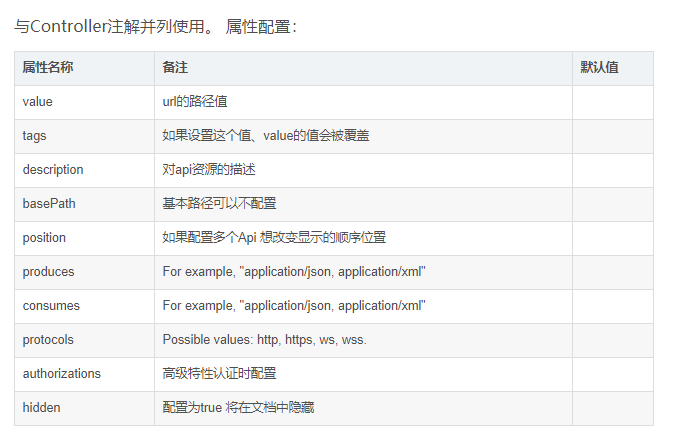

### @EnableSwagger2

### @Api
1. **作用位置：Controller类上**；标记一个Controller类作为swagger文档资源，对请求类的说明；
 
2. 主要属性：
```
tags = "说明该类的作用"
```
### @ApiOperation
1. **作用位置：请求的方法上**；说明请求的作用
2. 主要属性：
```
value = "说明方法的作用"
notes = "方法的备注说明"
```

### @ApiImplicitParams、@ApiImplicitParam：对方法参数的说明
```
@ApiImplicitParams：用在请求的方法上，包含一组参数说明
	@ApiImplicitParam：对单个参数的说明	    
	    name：参数名
	    value：参数的说明、描述
	    required：参数是否必须必填
	    paramType：参数放在哪个地方
	        · query --> 请求参数的获取：@RequestParam
	        · header --> 请求参数的获取：@RequestHeader	      
	        · path（用于restful接口）--> 请求参数的获取：@PathVariable
	        · body（请求体）-->  @RequestBody User user
	        · form（普通表单提交）	   
	    dataType：参数类型，默认String，其它值dataType="Integer"	   
	    defaultValue：参数的默认值
```

### @ApiResponses、@ApiResponse：方法返回值的状态码说明
```
@ApiResponses：方法返回对象的说明
	@ApiResponse：每个参数的说明
	    code：数字，例如400
	    message：信息，例如"请求参数没填好"
	    response：抛出异常的类
```

### @ApiModel
1. **作用在javaBean上**，表示对javaBean功能描述。主要在返回值或者请求值被封装成对象时使用，用来说明各个参数的意义；
2. **@ApiModelProperty标签用在bean上的属性中，用来说明每个属性的信息**
```
value–字段说明 
name–重写属性名字 
dataType–重写属性类型 
required–是否必填 
example–举例说明 
hidden–隐藏
```


参考文献：
https://blog.csdn.net/xiaojin21cen/article/details/78654652

https://blog.csdn.net/qq_35809345/article/details/108246107?utm_medium=distribute.pc_relevant_t0.none-task-blog-BlogCommendFromMachineLearnPai2-1.channel_param&depth_1-utm_source=distribute.pc_relevant_t0.none-task-blog-BlogCommendFromMachineLearnPai2-1.channel_param