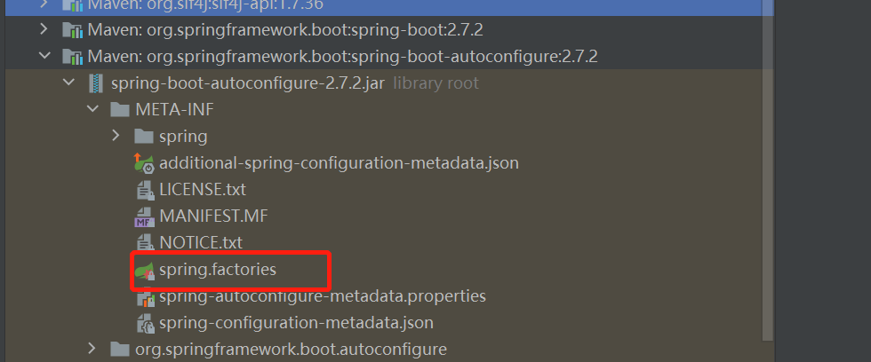

## 启动器

如spring-boot-start-web，springboot将每种功能封装成一个个启动器


## 主程序

```java
@SpringBootConfiguration: springboot的配置
	@Configuration：spring的配置类

@EnableAutoConfiguration：自动配置
	@AutoConfigurationPackage：自动配置包
		@Import({AutoConfigurationPackages.Registrar.class})：自动配置（包注册）
	@Import({AutoConfigurationImportSelector.class})：自动配置导入选择器
```

1. `AutoConfigurationImportSelector`代码中有选择对应装配配置的类方法：

```java
protected AutoConfigurationImportSelector.AutoConfigurationEntry getAutoConfigurationEntry(AnnotationMetadata annotationMetadata) {
        if (!this.isEnabled(annotationMetadata)) {
            return EMPTY_ENTRY;
        } else {
            AnnotationAttributes attributes = this.getAttributes(annotationMetadata);
            //获取所有配置
            List<String> configurations = this.getCandidateConfigurations(annotationMetadata, attributes);
            configurations = this.removeDuplicates(configurations);
            Set<String> exclusions = this.getExclusions(annotationMetadata, attributes);
            this.checkExcludedClasses(configurations, exclusions);
            configurations.removeAll(exclusions);
            configurations = this.getConfigurationClassFilter().filter(configurations);
            this.fireAutoConfigurationImportEvents(configurations, exclusions);
            return new AutoConfigurationImportSelector.AutoConfigurationEntry(configurations, exclusions);
        }
}
```

2. `AutoConfigurationImportSelector`中提供除了springboot自动配置的配置类外，还有对自定义额外配置类进行读取的方法。

```java
protected List<String> getCandidateConfigurations(AnnotationMetadata metadata, AnnotationAttributes attributes) {
        List<String> configurations = new ArrayList(SpringFactoriesLoader.loadFactoryNames(this.getSpringFactoriesLoaderFactoryClass(), this.getBeanClassLoader()));
        ImportCandidates.load(AutoConfiguration.class, this.getBeanClassLoader()).forEach(configurations::add);
        Assert.notEmpty(configurations, "No auto configuration classes found in META-INF/spring.factories nor in META-INF/spring/org.springframework.boot.autoconfigure.AutoConfiguration.imports. If you are using a custom packaging, make sure that file is correct.");
        return configurations;
}

//该方法说明配置了EnableAutoConfiguration标签的类都会被识别以及读取
protected Class<?> getSpringFactoriesLoaderFactoryClass() {
    return EnableAutoConfiguration.class;
}
```

 自动配置的核心文件

```
META-INF/spring.factories
```



