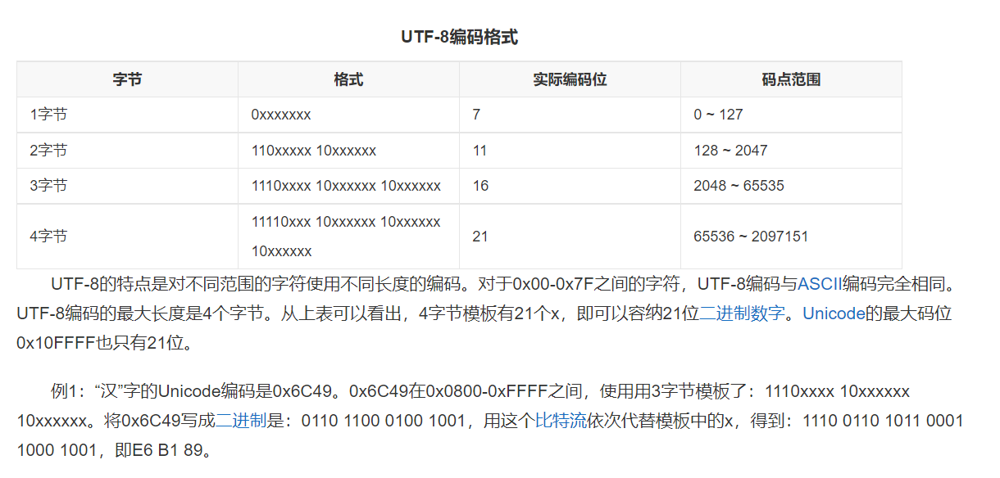
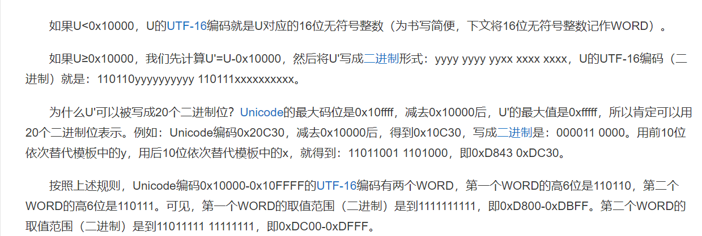

## ASCII码

1. 是一套针对拉丁文字母的**西文编码标准**；
2. 具体是仅针对0-9数字、a-z大小写字母以及一些特殊运算符、标点符号等进行编码定义；`html实体编码`以`&#`开头；

## Unicode编码

1. `统一码、万国码`，说明是针对所有语言的字符进行编码的方案；

2. 原理：

   1. 先将不同语言文字统一翻译成一串数字（即一种语言的一个文字对应一串数字）；有两个概念：`UCS-2`，即使用两个字节编码，可表示2^16^ =65536个文字（吗位）;`UCS-4`，即使用4个字节编码，是`UCS-2`的增强，可表示更多的文字； 

      > 这一步可以先理解成，把提前准备两个两个字节大小（65536个桶），对应65536个不同的文字；

   2. `USC-4`使用4个字节，最高位字节的最高位为0，分成2^7^ = 128个`group`，每个`group`再由次高位的字节分为2^8^=256个**平面**，每个平面再由第三、四个字节分出2^16^= 65536个码位；暂时使用了17个平面，一共17*65536 = 1114112个码位，使用16进制表示为：可表示从0到`0x10FFFF`。

   3. **以上第一和第二点均为Unicode的编码方式（逻辑），下面要转换成具体计算机存储的格式，即存放成具体字节码格式**；

   4. 使用`UTF-8`、`UTF-16`、`UTF-32`的方式将上面转换的数字再一次转换成字节码表示，即这三种为`Unicode`的实现方式。

## `UTF-8`编码实现

1. 是以8位（一个字节位单位）对``Unicode数字`进行字节码编码实现；`Unicode数字`是从0到1114112的，直接转换成二进制则一共需要21位才能全部表示；而`UTF-8`编码将按一定规则将其以字节为单位重新进行字节码编码表示；

2. 以字节位单位表示称为：`BYTE`;

3. 具体编码规则：

   

## `UTF-16`编码实现

1. 以16位无符号整数（即两个字节）为单位对`Unicode数字`进行编码表示；

2. 以16位为编码单位称为WORD；

3. 具体编码规则：

   

4. 上述描述补充：`0x10000`二进制表示需要16位，即如果`Unicode数字`超过二进制表示16位（两个字节）则使用第二种二进制编码方式，需要填充固定的二进制；

## `UTF-32`编码实现

1. 类似上面，是以32位为单位对``Unicode`数字进行二进制编码表示；
2. 以32位为单位称为`DWORD`;

## 参考

https://blog.csdn.net/zmx729618/article/details/51381655