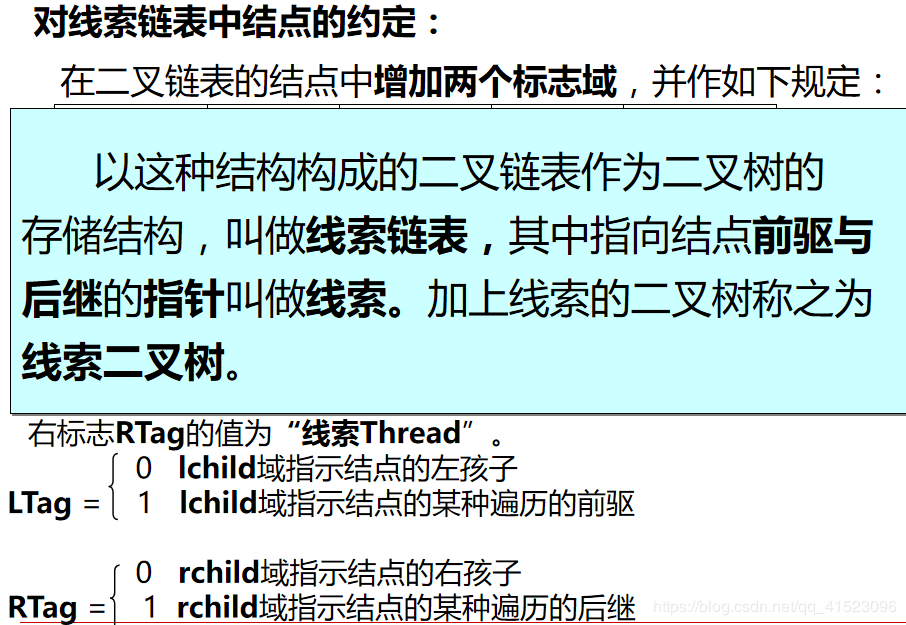

1. 定义
    以分支关系定义的层次结构；
    树是n个节点的有限集，有且仅有一个特定根节点，其他节点又可以组成一个树的集合；

2. 基本术语
    结点：数据元素；
    结点的度：结点拥有的子树数；
    叶子结点：度为0的节点；
    树的度：各节点度的最大值；
    孩子、双亲
    兄弟：同一个双亲的孩子之间互称为兄弟；
    树的深度：树的结点的最大层次数；
    堂兄弟：双亲在同一层的结点；
    有序树：树中各节点的子树从左到右有序为有序树？

3. 二叉树
    1. 所有节点的度为2的树；
    2. 性质一：第i层的节点最多有2的（i-1）次方个节点，i>0；
    3. 性质二：深度为K的二叉树最多有2的K次方-1个节点；
    4. 性质三：若有n个叶子结点，k个度为2的节点，并存在：**n=k+1**；
    5. **以上性质可以使用二进制的计算来记忆**；
    6. 满二叉树：每层上的节点数都是最大的；
    7. 完全二叉树：节点的顺序与位置（编号）与满二叉树一一对应；特点：(1)叶子结点只可能出现在层次最大的两层上；(2)对任意节点，若其右分支最大层数为I，则其左分支最大层数为I或者I+1；
    8. 具有n个结点的完全二叉树的深度为logn(向下取整)+1;
    9. 树编号的规则为：**从上到下，从左到右**；**i/2(向下取整)编号的节点为i节点的双亲节点**；**2i为其左孩子节点**；**2i+1为其右孩子结点**；

4. 树的存储
    1. 顺序存储（数组）：
        >* 按完全二叉树的编号作为数组下标对结点数据进行存储；若二叉树为非完全二叉树，则**必须将对应位置空出或者用0补充**；
        >* 因此该方法仅适用于完全二叉树；
    2. 二叉链表：
        >将一个结点分为三个部分，一部分存放结点本身数据，另外两部分分为指针存放左右孩子的地址；
        >有N个节点的二叉链表中，有多少个空指针域？答：n+1个(使用二进制计算来理解，**即看成是满二叉树，n个节点原有K层，则k+1层的节点数为n+1**)

5. 先序、中序、后续遍历树
DLR先序：根左右；
LDR中序：左根右；
LRD后续：左右根；
由先序和中序遍历序列确认一个二叉树：由先序序列确定二叉树的根节点；中序序列确定二叉树的左右子树序列；

6. 线索二叉树
将指向线性序列中的前驱或后续的指针称为线索；在二叉链表中增加这两个标志域的为线索链表

7. 哈夫曼树

查找一颗普通树的第K个最小值；