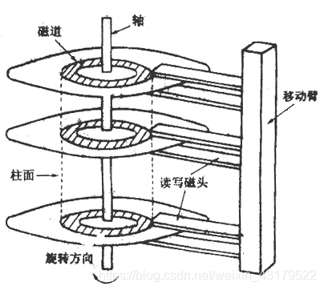

## 磁盘基本概念

- 盘片与盘面：一块硬盘有多块盘片组成，盘片中记录数据的那一面称为盘面（一般双面都用于记录数据）；
- 磁头：磁头是用于读写盘面上的数据的设备。磁头切换磁道时间较长（通过机械设备实现），切换盘面时间较快（通过电子设备实现）。
- 磁头数 = 盘面数 = 盘片数*2

- 磁道：是以中心为轴的，盘面上的**一圈存储数据的介质**；磁道之间有间隙；磁道上布有一层磁介质，通过磁头可以使磁介质的极性转换为操作系统的数据信号(即磁盘的读,磁盘写刚好相反)。

- 柱面：由磁盘中不同盘面的相同磁道组成，所以柱面数 = 某个盘面的磁道数；

- 扇区：单个磁道就是由多个弧形扇区组成；

  - **某个盘面上的每个磁道拥有的扇区数量是相等**。
  - 扇区是磁盘**最小的存储单位**。但不是文件系统最小存储单位。
  - 磁盘上所有扇区存储大小都一致，一般大小为512字节；（这里是指存储的数据量大小，并不是面积大小）

- 文件系统的最小存储单位称为：`block`（块），由**数个相邻扇区**组成，具体数量根据不同文件系统决定。

  > 由于一个个扇区读取效率太低（一个扇区存储数据量少），所以一次读取多个扇区。

## 磁盘读取时间

- 寻道时间：磁头在不同磁道之间移动的时间。
- 旋转延迟：中轴将磁头旋转到磁道的初始扇片所需时间。
- 传输时间：寻道定位完成后，磁头在盘面旋转，实际读取数据的时间。
- 读写一次磁盘信息所需的时间可分解为：寻道时间、延迟时间、传输时间。
- **为提高磁盘传输效率，软件应着重考虑减少寻道时间和延迟时间**。

## IO类型

- 随机IO：当读取完成第一个block之后，还需要重新经历寻道,旋转延迟,传输三个步骤才能读取完下一个block的数据，这种方式IO就是随机IO；
- 顺序IO：如果下一个block就在上一个block后面，不需要寻道、旋转延迟，则被称为顺序IO；