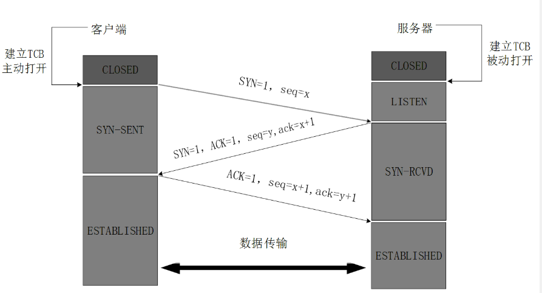
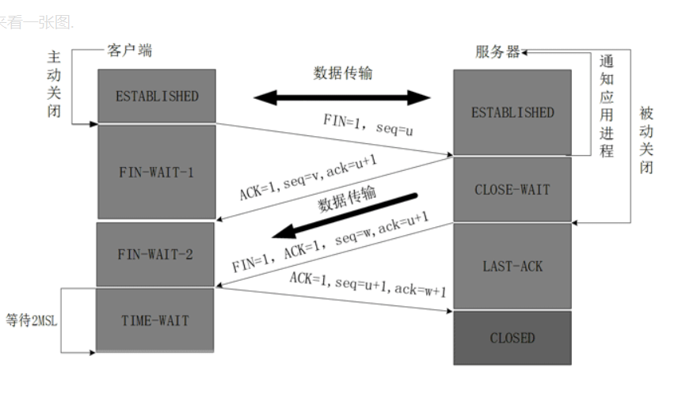

TCP/IP体系分为4/5层
>网络接口层（物理层、数据链路层）、网络层、传输层、应用层。

三次握手原理：
1. 一开始客户端和服务端都处于CLOSE状态。
2. 客户端主动发起连接请求，服务端被动接受连接请求；
3. 服务器端进程创建传输控制块TCB，处于LISTENER监听状态，时刻接受连接请求。
    客户端进程同样也要建立传输控制快TCB，发送请求连接报文，SYN=1(同步标志位)，其序列号为seq=x，不能携带数据但要消耗一个序列号，客户端进程进入SYN-SENT（同步已发送状态）。
4. 服务端进程接收到请求报文后，如果同意连接，则发出确认报文，SYN=1,ACK=1，且ack确认序号为x+1（根据请求报文的序号），而自己的报文序号为seq=y。此时服务器进入SYN-RCVD（同步收到状态）。
5. 客户端接收到回复后，同样也要发送接受确认报文，ACK=1,ack序号为y+1，自己的序号seq=x+1。此时建立连接，客户端处于连接建立状态。（ESTABLISHED）服务器端接收到后也进入连接建立状态。双方开始通信。

为什么不用两次？
> **主要是为了防止已经失效的连接请求报文传到服务器后，又重新建立连接，从而产生错误。**如果采用两次握手，则会出现该情形：客户端发送一请求报文，由于网络原因没有丢失只是滞留时间过长，客户端等待确认报文过久，以为请求丢失，则会重新发送请求报文，通过两次握手与服务器完成连接，传输数据并关闭连接后；**之前滞留的请求报文到达服务端**，这个报文本应是失效的，但因两次握手机制会重新创建连接，导致不必要的错误。
>如果采用三次握手，则客户端对于失效请求报文的确认不会发送到服务端，就不会创建连接。

四次握手原理：
1. 客户端主动断开连接，服务器被动断开连接。
2. 客户端**发送连接释放报文**，并且停止发送数据。释放数据报文首部，**FIN=1**，其序列号未seq=u（等于前面已经传送过来的数据的最后一个字节的序号加1），**此时客户端进入FIN-WAIT-1（终止等待1）状态**。TCP规定，FIN报文段即使不携带数据，也要消耗一个序号。
3. 服务器进程收到连接释放报文，**发出确认报文**，ACK=1，确认序号为u+1，自己的序列号为seq=v，**此时服务端就进入了CLOSE-WAIT（关闭等待状态）**
    >TCP服务器通知高层的应用程序，客户端向服务器的方向就释放了，这时候处于半关闭状态，即客户端已经没有数据要发送了，但是服务端还可以发送数据，客户端仍要接受。这个状态还要持续一段时间。
4. 客户端在**收到服务器的确认请求后**，**进入FIN-WAIT-2（终止等待2）状态**，等待服务器发送连接释放报文。**（还会接受服务器发送的最终数据）**
5. 服务器将最后的数据发送完后，向**客户端发送连接释放报文，FIN=1，**确认序号为u+1，由于处于半关闭状态，服务器可能还发送一些数据，序列号为seq=w，此时服务器就进入**LAST-ACK（最后确认）状态**，等待客户端的确认。
6. **客户端收到服务器的连接释放报文后，必须发送确认，ACK=1**，确认序号为w+1，而自己序列号是u+1，此时，**客户端就进入TIME-WAIT(时间等待)状态。但是此时连接TCP连接不释放，必须经过2*MSL（最长报文段寿命）的时间后，当客户端撤销相应的TCB后，才进入CLOSED状态。**
7. 服务器只要收到了客户端发出的确认，立即进入CLOSED状态，结束此次TCP连接。

8. 为什么是四次挥手
>因为服务器收到了连接释放请求时，仅仅代表客户端不在发送信息，当服务端可能还会发送数据，所以需要再发送一次连接释放请求。

9. 为什么要等待2*MSL时间？
>* 第一：保证最后一个确认报文能到达服务器端，如果确认报文丢失，则服务端会重新发送释放报文，客户端能在该时间内收到该报文并发确认报文和重新计时；
>* 第二：防止类似三次握手中的已失效的连接请求报文出现，因为等待2MSL，所以所有本连接产生的报文都会消失，这样新连接中就没有旧连接的请求报文。

10. 如果已建立连接后，客户端突发故障要怎么办？
>TCB设有一个保活计时器，服务端每收到客户端信息会重置该计时器，时间常为2小时；如果2小时后没有收到客户端的数据，服务端会发送探测报文段，每75分钟发送一次，若一连发送10个探测报文段没有反应，则服务器就认为客户端出了故障会关闭连接。

TCP和UDP的区别
>* TCP:**可靠的、稳定的、面向字节流、全双工的可靠信道、基于连接**的数据传输协议，会有三次握手来建立连接，并且在数据传输时，有确认、窗口、重传、拥塞控制机制，在数据传完后，还会断开连接用来节约系统资源。缺点在于：**资源占用多，效率低，慢，不安全**；因为建立连接消耗时间，而且占用大量资源，每个传输机制都会耗费时间，容易因为确认机制、三次握手机制被人利用。
>*  UDP：**速度快、面向报文、无状态、不可靠**的传输协议，没有确认、拥塞等机制；缺点：不可靠，不稳定，常用于要求速率而可靠性要求不高的地方，如视频通话等。
>*  区别总结：1. TCP基于连接与UDP无连接;2. 对系统资源要求；3. UDP程序结构简单；4. 流模式和数据报模式；5. 数据正确性；

IPV4和IPV6
