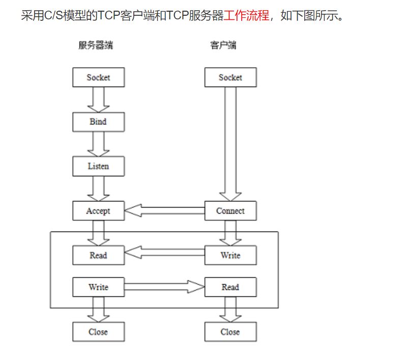

## 套接字通信

### 一、什么是套接字

1. 套接字是网络通信中==应用层的进程之间通信==（既可以是同一个服务器之间进程通信，可以是不同服务器之间进程的通信）的一种==网络机制（约定）==，用于完成通信过程；
2. 套接字位于传输层与应用层之间，是应用通过传输层协议（TCP/UDP）实现应用层协议（HTTP等）的接口；
3. socket编程就是通过调用一系列`Socket API`来完成应用层协议（HTTP/FTP）
4. 其具体实现实际上看做是一个数字结构，包含了通信协议、IP端口等信息；

### 二、套接字（`Socket`）结构

由三个参数指定：通信目的地址、使用传输层协议（TCP/UDP）、使用端口号

### 三、通信模型

1. 调用`socket()`函数创建套接字

2. `bind`函数分配IP地址和端口
3. `Listen`进行监听，等待客户端链接
4. ==**客户端**==通过`socket()`创建自己的套接字后，调用`connect()`方法发起连接；
5. 当请求过来时，调用`accept`函数接受请求，返回==一个对应本次连接的新套接字==，做好通信准备；
6. 进行读写之后，通过`accept`返回的套接字与客户端进行通信返回
7. 使用`close()`关闭socket；

### 四、各函数分析

1. `socket()`函数

   

   >  定义了一个套接字对应的协议与通信服务类型；

2. `bind()`函数

   > 定义了IP与服务的端口号，赋值给socket()创建的套接字里

3. `listen()`函数

   > 创建一个监听队列用于存放待处理的通信连接，有连接请求时，调用accept()创建连接；

4. `accept()`函数

   > 1. 返回一个新的socket（已连接套接字），唯一标识接受了的新连接；该函数的作用实际上就是做好连接准备，与客户端一起创建连接；
   >
   > 2. 由于需要客户端配合才能完整创建连接，所以该方法会阻塞；

5. `connect()`函数

   > 实现客户端主动连接服务端的工作以及完成通信连接的创建；

6. `close()`函数

   > 关闭创建的socket

### 参考：

http://cw.hubwiz.com/card/c/56f9ee765fd193d76fcc6c17/1/3/1/
