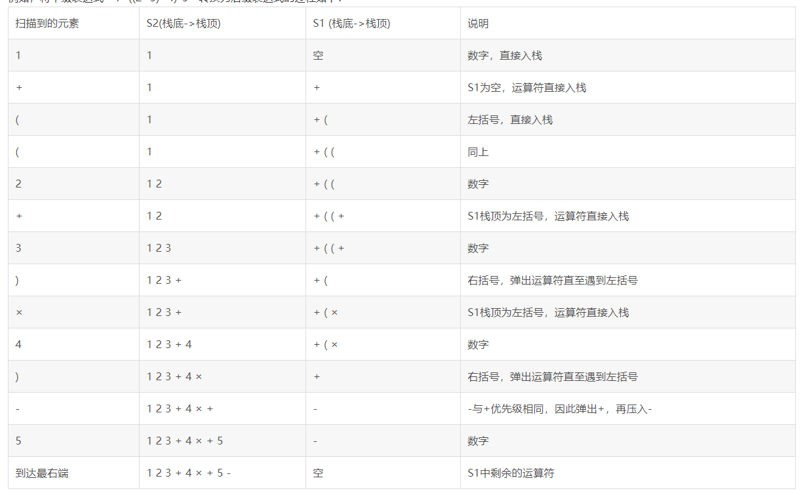

#面试咋装
1. 简历希望能附加上对各项技能的熟练度。
2. 补充设计思想与设计模式的知识点；
>* 设计思想：

>* 设计模式:
>1. 工厂模式：普通/简易工厂；方法工厂；抽象工厂；
>2. 单例模式：饿汉式；双锁,静态内部类，懒人式；
>3. 代理模式：
>4. 策略模式：
>5. 命令模式：方法把一个对象作为参数传入，方法调用该对象的某一个方法。

3. 数据库事务有传递性，如事务A在调用事务B时，如果事务B发生错误回滚，A的操作也会回滚吗？
4. 接口和抽象类的区别，以及应用：接口同一属性和方法，抽象类使用策略模式；
5. spring的启动流程、bean的周期；
6. 微服务；

#奇安信的笔试
1. 网络工程的重新了解；
2. 系统结构；
3. 两道算法题：
(1) 1000硬币中有10个金币，输入取金币的数量，取出金币中有金币的概率；**保留小数点后6位**
使用BigDecimal类的setScale方法；**setScale(int 位数,舍入模式)**

舍入模式：
1. BigDecimal.ROUND_UP：
当舍入部分**全为0**时，不进1否则就进1；如：3.007001和3.007000，这个模式下保留3位分别为：3.008和3.007（趋向远离0的方向舍入，即绝对值大于0就进位，与正负无关）；
2. BigDecimal.ROUND_DOWN：
**正负无关，不管如何都不会进位**，全为0或者不为0都不会进位，如：3.007001和3.007000，这个模式下保留3位分别为：3.007和3.007；
3. BigDecimal.ROUND_CEILING：
>**若为正数：**则是ROUND_UP；
>**若为负数：**则是ROUND_DOWN；
4. BigDecimal.ROUND_FLOOR：
与第3点反着来。
5. BigDecimal.ROUND_HALF_DOWN：
**正负无关的**，被舍弃部分整体大于5进位，否则不进；如3.05500和3.05501，保留两位后分别为：**3.05和3.06**
6. ROUND_HALF_UP：
**正负无关的**，严格四舍五入，即只看被舍弃部分的第一位，普通的理解的四舍五入。如：4.6500和4.6499，保留1位小数分别为：**4.7和4.6**
7. ROUND_HALF_EVEN：
**银行家舍入**，**四舍六入，五看情况**，如果前一位为奇数则进位，否则舍去。如：1.75与1.65，保留一位小数时，分别为1.8和1.6。
8. ROUND_UNNECESSARY：
断言请求的操作具有精确的结果，因此不需要舍入。
如果对获得精确结果的操作指定此舍入模式，则抛出ArithmeticException。

(2) 五个月后生兔子。使用f(n)=f(n-1)+f(n-4),**通过率为80%，因为使用了int数组，导致越界，要用Long类型**
代码：
```
public static void main(String[] args){
        Scanner sc = new Scanner(System.in);
        int n = sc.nextInt();
        System.out.println(countAb(n));
    }
    public static Long countAb(int n){
        if(n<5){
            return 1L;
        }
        Long[] a = new Long[n];
        for(int i =0;i<4;i++){
            a[i] = 1L;
        }
        for(int i =4;i<n;i++){
            a[i] = a[i-1] + a[i-4];
        }
        return a[n-1];
    }
```

4. 解决哈希冲突的主要方法：
    1. 开放地址法（再散列法）
        产生冲突后对哈希值进行再计算，其通用函数形式为：、Hi=（H（key）+di）% m   i=1，2，…，n
        其中H（key）为哈希函数，m 为表长，di称为增量序列。**增量序列的取值方式不同**，相应的再散列方式也不同。主要有以下三种：
        * （1）线性探测法：
            dii=1，2，3，…，m-1这种方法的特点是：冲突发生时，**顺序查看表中下一单元**，直到找出一个空单元或查遍全表。
        * （2）线性补偿探测法：
            把di序列的步长从1改为Q，**Q与m是互质的**。能完全遍历整个空间（互质，所以因式分解后为di%m，避免相同分数出现）。
        * （3）伪随机探测：
            di为一个随机数序列。
    2. 拉链法：
        采用链表形式存储；
5. 后缀表达式
    普通表达式如：1+((2+3)*4)-5为中缀表达式；
    后缀表达式(逆波兰式):运算符位于操作数之后；
    >中缀表达式转后缀表达式：
    >* 初始化两个栈，运算符栈S1和数据栈S2；
    >* 从左到右扫描表达式，**遇到操作数**就压入S2中，遇到运算符就与S1的栈顶运算符比较优先级；
    >* 优先级比栈顶高的把新运算符压入S1栈中；若**相同或者小于**则将**栈顶运算符弹出到S2中**并将新运算符压入S1中。
    >* 遇到左括号直接压入S1中，遇到有括号则将S1中运算符弹出到S2中，直到遇到右括号。
    >* 遍历到最后，将S1中运算符输出到S2中。
    
6. hashMap、WeakMap、AbstractSet
    引用类型，转至基础（3）